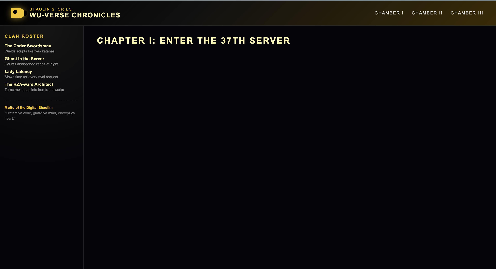

# 🪄 Magic

OOLLM: Think it, call it, chain it: Magic lets you call and compose any method you can think of using fluent Ruby.

[](https://github.com/pcarolan/magic/actions/workflows/test.yml)

## Setup

1. Set `OPENAI_API_KEY` to a valid openai key
1. Install ruby `>= ruby 3.3.4` (that's it! no other dependencies)

## Usage

1. Run tests `ruby test_magic.rb` to make sure everything's working properly
1. Run an interactive session `irb` (from the root directory)

## Roadmap

- [x] single method execution with and without arguments
- [x] method chaining with and without arguments
- [ ] strong types
- [ ] recursion
- [ ] caching

## Try it

```bash
$ irb
DEBUG is set to true
magic is ready 🪄, type `@magic = Magic.new` to get started

>> @magic = Magic.new
>> @magic.emoji_getter('happy camper')

🔮 Step 1: emoji_getter("happy camper")
   → "🏕️🙂"
=> 🏕️🙂

```

## Examples

### Single Method Calls

```ruby
@magic = Magic.new

result = @magic.random_number(0..1000)
result
=> 746

result.class
=> Magic


# Other examples:
@magic.state_capital('Michigan', 'USA')
=> Lansing

@magic.types_of_cheese_in_geo('world')
=> Cheddar, Mozzarella, Parmesan, Brie, Gouda, Swiss, Blue, Feta, Provolone, Monterey Jack, Camembert, Colby, Havarti, Manchego, Ricotta, Gorgonzola, Gruyère, Roquefort, Emmental, Asiago

@magic.types_of_cheese_in_geo('france')
=> Brie, Camembert, Roquefort, Comté, Reblochon, Munster, Emmental, Beaufort, Cantal, Saint-Nectaire, Pont-l’Évêque, Livarot, Chèvre (various goat cheeses), Tomme de Savoie, Bleu d’Auvergne, Bleu de Gex, Boursin, Neufchâtel, Ossau-Iraty, Morbier

```

### Method Chaining

Magic enables fluent API method chaining. Each method call makes an immediate API request and passes the previous result as context to the next call.

#### Example 1: Chaining Two Methods

```ruby
>> result = @magic.random_number.multiply_by(5)

🔮 Step 1: random_number
   → "271"

🔮 Step 2: multiply_by(5)
   → "1355"
=> 1355

puts "History length: #{result.instance_variable_get(:@history).length} steps"
# => History length: 2 steps
```

#### Example 2: Chaining Three Methods

```ruby
>> result = @magic.random_number.multiply_by(5).add(10)

🔮 Step 1: random_number
   → "70628"

🔮 Step 2: multiply_by(5)
   → "353140"

🔮 Step 3: add(10)
   → "353150"
=> 353150
```

#### Example 3: Accessing Intermediate Results

```ruby
>> step1 = @magic.get_number

🔮 Step 1: get_number
   → "42"
=> 42
>> puts "Step 1 result: #{step1.result}"
Step 1 result: 42

>> step2 = step1.double_it

🔮 Step 2: double_it
   → "84"
=> 84

>> step3 = step2.add(100)

🔮 Step 3: add(100)
   → "184"
=> 184

>> puts "Full chain inspect: #{step3.inspect}"
Full chain inspect: #<Magic history=3 steps, result="184">
```

#### Key Features:

- Each method call makes an immediate API request
- Previous result is passed as context to next call
- Magic instances are immutable (functional style)
- Auto-executes on `puts`/string interpolation via `to_s`
- Access raw result via `.result` method
- View chain history via `.inspect` method

### Pipeline Processing & Nested Data Navigation

Magic enables powerful data transformation pipelines through its context-aware chaining. Magic's chaining allows for sequential transformations where each step receives context from previous operations.

#### Example 1: Data Pipeline Processing

```ruby
# Transform data through multiple steps
>> result = @magic.list_us_presidents
>>   .take_first(5)
>>   .get_birthplaces
>>   .find_common_state

🔮 Step 1: list_us_presidents
   → "George Washington\nJohn Adams\nThomas Jefferson\nJames Madison\nJames Monroe\nJohn Quincy Adams\nAndrew Jackson\nMartin Van Buren\nWilliam Henry Harrison\nJohn Tyler\nJames K. Polk\nZachary Taylor\nMillard Fillmore\nFranklin Pierce\nJames Buchanan\nAbraham Lincoln\nAndrew Johnson\nUlysses S. Grant\nRutherford B. Hayes\nJames A. Garfield\nChester A. Arthur\nGrover Cleveland\nBenjamin Harrison\nGrover Cleveland\nWilliam McKinley\nTheodore Roosevelt\nWilliam Howard Taft\nWoodrow Wilson\nWarren G. Harding\nCalvin Coolidge\nHerbert Hoover\nFranklin D. Roosevelt\nHarry S. Truman\nDwight D. Eisenhower\nJohn F. Kennedy\nLyndon B. Johnson\nRichard Nixon\nGerald Ford\nJimmy Carter\nRonald Reagan\nGeorge H. W. Bush\nBill Clinton\nGeorge W. Bush\nBarack Obama\nDonald Trump\nJoe Biden"

🔮 Step 2: take_first(5)
   → "George Washington\nJohn Adams\nThomas Jefferson\nJames Madison\nJames Monroe"

🔮 Step 3: get_birthplaces
   → "Westmoreland County, Virginia\nBraintree, Massachusetts\nShadwell, Virginia\nPort Conway, Virginia\nWestmoreland County, Virginia"

🔮 Step 4: find_common_state
   → "Virginia"
=> Virginia
```

#### Example 2: Nested Object Navigation

```ruby
# Drill down through nested data structures
>> result = @magic.countries_in('Europe')
>>   .get_details('France')
>>   .largest_city
>>   .population

🔮 Step 1: countries_in("Europe")
   → "Albania\nAndorra\nArmenia\nAustria\nAzerbaijan\nBelarus\nBelgium\nBosnia and Herzegovina\nBulgaria\nCroatia\nCyprus\nCzechia\nDenmark\nEstonia\nFinland\nFrance\nGeorgia\nGermany\nGreece\nHungary\nIceland\nIreland\nItaly\nKazakhstan\nKosovo\nLatvia\nLiechtenstein\nLithuania\nLuxembourg\nMalta\nMoldova\nMonaco\nMontenegro\nNetherlands\nNorth Macedonia\nNorway\nPoland\nPortugal\nRomania\nRussia\nSan Marino\nSerbia\nSlovakia\nSlovenia\nSpain\nSweden\nSwitzerland\nTurkey\nUkraine\nUnited Kingdom\nVatican City"

🔮 Step 2: get_details("France")
   → "Capital: Paris\nPopulation: ~68 million\nOfficial language: French\nGovernment: Unitary semi-presidential republic\nCurrency: Euro (€)\nArea: ~551,700 km² (metropolitan France)\nContinent/Region: Western Europe\nEU member: Yes (founding member)\nNotable: Largest country in the EU by area; major global center for culture, fashion, cuisine, and wine; key role in EU and international politics."

🔮 Step 3: largest_city
   → "Paris"

🔮 Step 4: population
   → "2165423"
=> 2165423
```

#### Example 3: Computational Pipelines

```ruby
# Chain mathematical operations
>> result = @magic.factorial(5)
>>   .multiply_by(2)
>>   .add(10)

🔮 Step 1: factorial(5)
   → "120"

🔮 Step 2: multiply_by(2)
   → "240"

🔮 Step 3: add(10)
   → "250"
=> 250
```

#### Example 4: Context-Aware Operations

```ruby
# Operations that can reference previous context
>> result = @magic.number(10)
>>   .double_it      # 10 * 2 = 20
>>   .add_previous   # 20 + 10 = 30 (LLM can access original context)
>>   .square         # 30^2 = 900

🔮 Step 1: number(10)
   → "10"

🔮 Step 2: double_it
   → "20"

🔮 Step 3: add_previous
   → "20"

🔮 Step 4: square
   → "400"
=> 400
```

## Webserver / example page

There is a tiny example webserver (`server.rb`) and an ERB template (`index.html.erb`) that demonstrates embedding `Magic` output into a web page.

- server: `server.rb` — a small WEBrick server (port 3000) that renders `index.html.erb`.
- template: `index.html.erb` — calls `@magic.generate_html(...)` and inserts the returned HTML into the page.

How to run

```bash
# set your OpenAI key first (required)
export OPENAI_API_KEY="sk-..."

# start the example server
ruby server.rb

# then open http://localhost:3000 in your browser
```

What the template does

The `index.html.erb` file demonstrates a simple call to the `Magic` object:

```erb
<%= @magic.generate_html(
  tag: 'body', 
  theme: 'wu tang clan', 
  mode: 'dark',
  generate_content: "fan fiction",
  looks_like: "wu tang clan"
) %>
```

The example passes a few options to `generate_html` — these are just demonstration inputs (tag, visual theme, content type and style). `Magic` will return HTML (a string) that the template inserts into the page. This is a minimal demo of using `Magic` results inside a web UI — no frameworks or external gems required (only Ruby standard library: WEBrick + ERB).


Notes

- The server makes real LLM requests, so ensure `OPENAI_API_KEY` is set and be mindful of API usage.
- This example is intentionally minimal — use it as a starting point for building a small experiment or integrating `Magic` into your own web view.

#### How It Works

Magic's pipeline processing uses sequential execution with context passing:

1. **Context Passing**: Each chained call receives the previous result in the prompt:

   ```ruby
   # Previous result is automatically included
   "Previous result: {previous_value}"
   ```

2. **Chain History**: The `@history` array maintains a complete audit trail of all operations

3. **LLM Reasoning**: The LLM can reason about nested structures and relationships since it has access to full context

4. **Sequential Execution**: Each step:
   - **Executes independently**: Makes its own API call
   - **Receives context**: Gets previous result as input
   - **Passes forward**: Sends result to next step
   - **LLM-powered**: Intelligence comes from the LLM understanding data relationships

## References

- [OpenAI API](https://platform.openai.com/docs/guides/text)
- [Writing a good Claude MD prompt](https://www.humanlayer.dev/blog/writing-a-good-claude-md)
- 